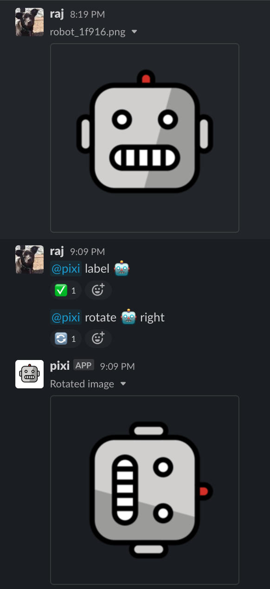

# How to label files for processing

1. Type `@pixi label :label:` to label the most recent image in a Slack channel or thread (e.g. `@pixi label 🤖`)
1. You can now refer to the label in other `@pixi` commands: `@pixi rotate 🤖 right`

