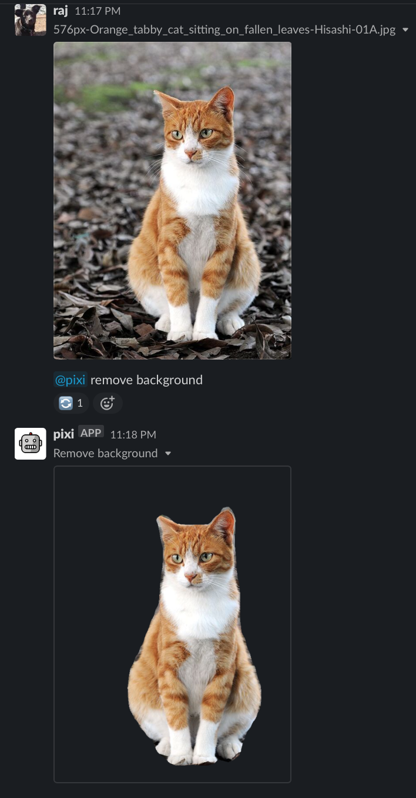

# How to remove the background from images in Slack

1. Install the Pixi Slack app.
1. Invite `@pixi` into a Slack channel (`/invite @pixi`).
1. Type `@pixi remove background` to remove the background from the most recent image posted in the channel or thread.

You can also remove the background from a [labeled image](label.md), using `@pixi remove background from :label:`

