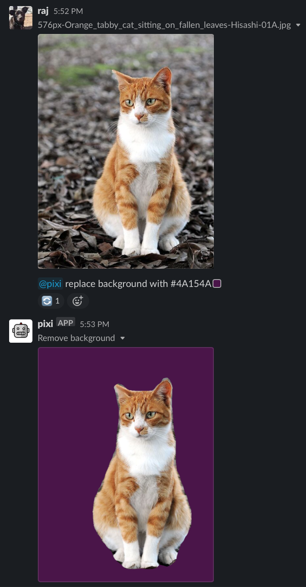

# How to replace the background of an image with a solid color

1. Install the Pixi Slack app.
1. Invite `@pixi` into a Slack channel (`/invite @pixi`).
1. Type `@pixi replace background with #00ccff` to replace the background of an image with the hex color #00ccff.

You can also replace the background of a [labeled image](label.md), using `@pixi replace background of :label: with #00ccff`

